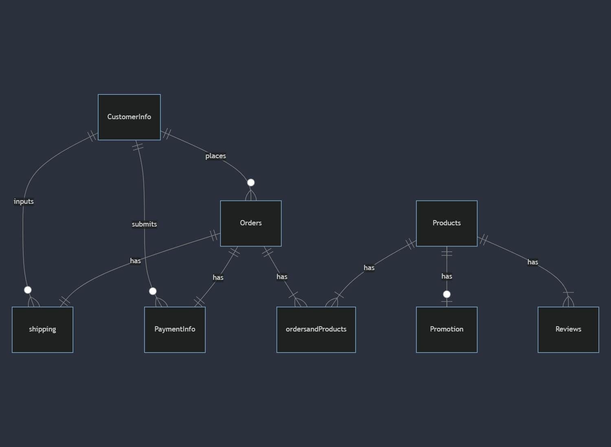

# Design Document

By Abdurrahman Elkhadrawy

Video overview: https://www.youtube.com/watch?v=_VQtaVl0KJI

## Scope

The Database for E-Commerece website includes all entities necessary to handle placing and storing a customers order info on e-commerce site. As such, included in the database's scope is:

* Products, including basic product information of the product itself
* Customers information, including information of the customer themselves
* Orders, includes information in regards to the order itself
* ordersandproducts, containing the relevant orders with their relevant products for analysis and customer troubleshooting. Functioning like a junction table between the orders and products.
* Payment info, includes information nessarcy for payment transactions like type of payment. Amount that was paid and more.
* shipping, contains shipping information it regards to where their shipping to and who is shipping it and much more!
* promotions, contains promotion information in regards to what the promotion is, for how long will it last and more!
* Review/Ratings, contains review infomration that gives us the rating, what they have to say about the product as well.

Out of scope are elements like customers tracking data like what sites they visit etc. We will be maintaing privacy as much as possible and keeping only the information that customers input on the website itself.

## Functional Requirements

* CRUD operations for the products, customers, orders, payment info, shipping, promotions, and reviews to make sure info is up to date
* Track shipping and payment info to make sure customer complaints are handlded efficiently
* The ability to add a start/end time to a promotion so that you dont accidently run multiple promotions at the same time for different products which you didnt intend for

 Recommendations for products based on tracking info won't be supported. The only profile we will have on the user is what the user inputted themselves. Hence were not storing external user data anywhere in our database. Only crucial information about our users will be stored.

## Representation

Entities are captured in MYSQL tables with the following schema.

### Entities

The database includes the following entities:

#### Products

The `products` table includes:

* `id`, which specifies the unique ID for the product as an `INT`. This column thus has the `PRIMARY KEY` constraint applied. This column also has a `AUTO_INCREMENT` contstraint applied so if we insert another product it will increment appropriately
* `name`, which specifies the name of the product as an `VARCHAR`. given `VARCHAR` is appropriate for name fields. A `NOT NULL` constraint ensures that every product has a name. A `UNIQUE` constraint ensures their are no two products with the same name.
* `type`, which specfies the type of product as an `VARCHAR`. given `VARCHAR` is appropriate for name fields. A `NOT NULL` constraint ensures that every product has a type.
* `categories`, which specfies the category of a product as an `VARCHAR`. given `VARCHAR` is appropriate for name fields. A `NOT NULL` constraint ensures that every product has a category.
* `description`, which specfies the description of a product as an `TEXT`. given `TEXT` is appropriate for long strings like paragraphs. A `NOT NULL` constraint ensures that every product has a description.
* `pricing`, which specfies the price of the product as a `DECIMAL`. `DECIMAL` is appropirate given prices are usually caculated as decimals and we can fix the precision to 2. `CHECK` constraint is also added to make sure we dont add negitive price values. A `NOT NULL` constraint ensures that every product has a price
* `quantity`, which specfies the amount of the product avaiable as a `INT`. `INT` is appropriate given that quantites usually represent whole numbers not decimals etc. `CHECK` constraint is also added to make sure we dont add negitive amount of a product. A `NOT NULL` constraint ensures that every product has a amount

#### CustomerInfo

The `CustomerInfo` table includes:

* `id`, which specifies the unique ID for the customer as an `INT`. This column thus has the `PRIMARY KEY` constraint applied. This column also has a `AUTO_INCREMENT` contstraint applied so if we insert another customerInfo it will increment appropriately
* `Username`, which specfies the username of the customer as a `VARCHAR`. `VARCHAR` is appropriate for name fields. A `NOT NULL` constraint ensures that every username is listed. A `UNIQUE` constraint ensures their are no two usernames with the same username.
* `Password`, which specfies the password of the customer as a `VARCHAR`. `VARCHAR` is appropriate for name fields. A `NOT NULL` constraint ensures that every password is listed. A `UNIQUE` constraint ensures their are no two passwords with the same password.
* `firstname`, which specfies the first name of the customer as a `VARCHAR`. `VARCHAR` is appropriate for name fields. A `NOT NULL` constraint ensures that every first name is listed.
*  `lastname`, which specfies the last name of the customer as a `VARCHAR`. `VARCHAR` is appropriate for name fields. A `NOT NULL` constraint ensures that every last name is listed.
* `phonenumber`, which specfies the phone number of the customer as a `CHAR`. `CHAR` is appropriate for name fields and specfies a certain limit of 15 since phone numbers typically in the U.S. dont go above that. A `NOT NULL` constraint ensures that every phone number is listed.

#### Orders

The `Orders` table includes:

* `id`, which specifies the unique ID for the order as an `INT`. This column thus has the `PRIMARY KEY` constraint applied. This column also has a `AUTO_INCREMENT` contstraint applied so if we insert another order it will increment appropriately
* `timeSubmitted`, which specfies the time the order was placed as a `DATETIME`. `DATETIME` is appropriate for when we want to know when the time and date of the order was placed.  A `NOT NULL` constraint ensures that every instance of a orders time is listed.
* `customerID`, which specfies the customer id as an `INT`. This column thus has the `FOREIGN KEY` constraint applied, referencing the `id` column in the `customerInfo` table, which ensures each order can be referenced back to the `customerInfo` table.
* `billingID`, which specfies the `id` for the billing information as a `INT`. This column thus has the `FOREIGN KEY` constraint applied, referencing the `id` column in the `PaymentInfo` table, which ensures each order can be referenced back to the `PaymentInfo` table.
* `shippingID`, which specfies the `id` for the shipping information as a `INT`. This column thus has the `FOREIGN KEY` constraint applied, referencing the `id` column in the `Shipping` table, which ensures each order can be referenced back to the `Shipping` table.

#### OrderandProducts

The `OrdersandProducts` table includes:

* `id`, which specifies the unique ID for the table as an `INT`. This column thus has the `PRIMARY KEY` constraint applied. This column also has a `AUTO_INCREMENT` contstraint applied so if we insert another order/product it will increment appropriately
* `orderID`, which specifies the order id from the orders table as a `INT`. This column thus has the `FOREIGN KEY` constraint applied, referencing the `id` column in the `Orders` table, which ensures each order can be referenced back to the `Orders` table.
* `productID`, which specifies the product id from the orders table as a `INT`. This column thus has the `FOREIGN KEY` constraint applied, referencing the `id` column in the `products` table, which ensures each order can be referenced back to the `products` table.
* `quantityPurchased`, which specfies the quanity of the product that was purchased as a `INT`. `INT` is appropraite given the quanitys are usually whole numbers. A `NOT NULL` constraint ensures that every amount of the quanity purchased is listed.

#### PaymentInfo

The `PaymentInfo` table includes:

* `id`, which specifies the unique ID for the table as an `INT`. This column thus has the `PRIMARY KEY` constraint applied. This column also has a `AUTO_INCREMENT` contstraint applied so if we insert another payment it will increment appropriately
* `customerID`, which specfies the customer id as an `INT`. This column thus has the `FOREIGN KEY` constraint applied, referencing the `id` column in the `customerInfo` table, which ensures each order can be referenced back to the `customerInfo` table.
* `paymentType`, which specfies the type of payment as a `ENUM`. `ENUM` is used since their are only so many choices like credit or debit. A `NOT NULL` constraint ensures that every payment type is listed.
* `PaymentStatus`,which specfies the type of payment as a `ENUM`. `ENUM` is used since their are only so many choices like approved or declined.A `NOT NULL` constraint ensures that every status is listed.
* `PaymentSubmissionTime`, which specfies the time the payment was was as a `DATETIME`. `DATETIME` is appropriate for when we want to know when the time and date of the payment was processed.  A `NOT NULL` constraint ensures that every instance of a payment is listed.
* `orderID`, which specifies the order id from the orders table as a `INT`. This column thus has the `FOREIGN KEY` constraint applied, referencing the `id` column in the `Orders` table, which ensures each order can be referenced back to the `Orders` table.
* `amountPaid`, which specfies the price of the order as a `DECIMAL`. `DECIMAL` is appropirate given orders are usually caculated as decimals and we can fix the precision to 2. A `NOT NULL` constraint ensures that every instance of a payment is listed.

#### Shipping

The `Shipping` table includes:

* `id`, which specifies the unique ID for the table as an `INT`. This column thus has the `PRIMARY KEY` constraint applied. This column also has a `AUTO_INCREMENT` contstraint applied so if we insert another shipping info it will increment appropriately
* `customerID`, which specfies the customer id as an `INT`. This column thus has the `FOREIGN KEY` constraint applied, referencing the `id` column in the `customerInfo` table, which ensures each order can be referenced back to the `customerInfo` table.
* `orderID`, which specifies the order id from the orders table as a `INT`. This column thus has the `FOREIGN KEY` constraint applied, referencing the `id` column in the `Orders` table, which ensures each order can be referenced back to the `Orders` table.
* `shippingAddress`, which specfies the address of the package being shipped as a `VARCHAR`. `VARCHAR` is appropriate for name fields. A `NOT NULL` constraint ensures that every address is listed.
* `shippingMethod`, which specfies the type of shipping as a `ENUM`. `ENUM` is used since their are only so many choices like standard or express.A `NOT NULL` constraint ensures that every type is listed.
* `shippingCost`, which specfies the cost of shipping as a `DECIMAL`. `DECIMAL` is appropirate given prices are usually caculated as decimals and we can fix the precision to 2.  A `NOT NULL` constraint ensures that every cost of shipping.
* `carrierName`, which specfies the type of carrier as a `ENUM`. `ENUM` is used since their are only so many choices like UPS,USPS,FEDX.A `NOT NULL` constraint ensures that every carrier is listed.
* `trackingID`, which is the id of the chosen shipping carrier as a `CHAR`. `CHAR` is appropriate for name fields and specfies a certain limit. A `NOT NULL` constraint ensures that every tracking id is listed.
* `orderStatus`, which is the status of the order being shipped as a `ENUM`. `ENUM` is used since their are only so many choices like pending,delivered,shipped.A `NOT NULL` constraint ensures that every status is listed.

#### Promotions

The `Promotion` table includes:

 promotion information(start date/end date), with its associated id, discount amount and description
* `id`, which specifies the unique ID for the table as an `INT`. This column thus has the `PRIMARY KEY` constraint applied. This column also has a `AUTO_INCREMENT` contstraint applied so if we create another promotion it will increment appropriately
* `productID`, which specifies the product id from the orders table as a `INT`. This column thus has the `FOREIGN KEY` constraint applied, referencing the `id` column in the `products` table, which ensures each order can be referenced back to the `products` table.
* `promoStartDate`, which specfies the time the promo starts as a `DATETIME`. `DATETIME` is appropriate for when we want to know when the time/date when the promo starts.  A `NOT NULL` constraint ensures that every instance of a promotional start is listed.
* `promoEndDate`, which specfies the time the promo ends as a `DATETIME`. `DATETIME` is appropriate for when we want to know when the time/date when the promo ends.  A `NOT NULL` constraint ensures that every instance of a promotional end is listed.
* `discountAmount`, which specfies the discount amount as a `DECIMAL`. `DECIMAL` is appropirate given that when we want to caculate the overall price having them represented as decimals will allow for easier caculation and we can fix the precision to 2. `CHECK` constraint is also added to make sure we dont add negitive values or any value we dont intend to add.  A `NOT NULL` constraint ensures we have a discount amount listed.
* `promoDescription`, which specfies the promos description as an `TEXT`. given `TEXT` is appropriate for long strings like paragraphs. A `NOT NULL` constraint ensures that every product has a description.

#### Reviews

The `Reviews` table includes:

* `id`, which specifies the unique ID for the table as an `INT`. This column thus has the `PRIMARY KEY` constraint applied. This column also has a `AUTO_INCREMENT` contstraint applied so if we add another review it will increment appropriately
* `productID`, which specifies the product id from the orders table as a `INT`. This column thus has the `FOREIGN KEY` constraint applied, referencing the `id` column in the `products` table, which ensures each order can be referenced back to the `products` table.
* `customerId`, which specfies the customer id as an `INT`. This column thus has the `FOREIGN KEY` constraint applied, referencing the `id` column in the `customerInfo` table, which ensures each order can be referenced back to the `customerInfo` table.
* `rating`, which specfies the rating of the associated product as a `INT`. `INT` is appropriate given that ratings are usually assigned whole numbers to it like 1-5. A `NOT NULL` constraint ensures that every review has a rating.
* `ratingDescription`, which specfies the ratings description as an `TEXT`. given `TEXT` is appropriate for long strings like paragraphs. A `NOT NULL` constraint ensures that every product has a description.

### Relationships

The below entity relationship diagram describes the relationships among the entities in the database.

As detailed by the diagram:

* Each shipment must be associated with exactly one customer, but a customer can have zero or many shipments (one to many relationship)
* Each payment must be associated with exactly one customer, but a customer might have zero or many payments made
* Each order must be associated with one customer, but a cusomter might have zero or many orders made
* Each order must have  one payment and one shippment information assocaited with it. Hence a one to one relationship, vice versa
* Regarding the ordersandProducts table this is a many to many relationship since each order can have many products associated with it and each product can have many orders associated with and each row of this junction table can only have one order and one product assocaited with it
* Every product has one or no promotion
* Every product has either one or many reviews, with one or many customers as well

## Optimizations

Per the typical queries in `queries.sql`, it is common for users of the database to access all the customer order information when trying to trouble shoot a issue with a ongoing order for example. For that reason, indexes are created on the `orderStatus` and `customerID` column on the `Shipping` table to speed up the customer search.

Similarly, it is also common practice for a user of the databse to be concerned with viewing how well the product is being recieved or how much of the product is available. As such, an index is created on the `quantity` column in the `products` table and `rating` column on the `Reviews` table to speed up inventory check up and well recieved products.

## Limitations

* The Current schema assumes that we only what the information that we need at the time of designing the database. For example if the company wants multiple promotions that  would require one category not to only have one promotion attached to it but many at the same time. Hence a many to many realtionship would be needed. Like if we had black friday sale and a first time user sale we wouldnt be able to apply both under our current design.
* Only one address can belong with one customer so multiple customers with the same address would have to be supported at the application level
